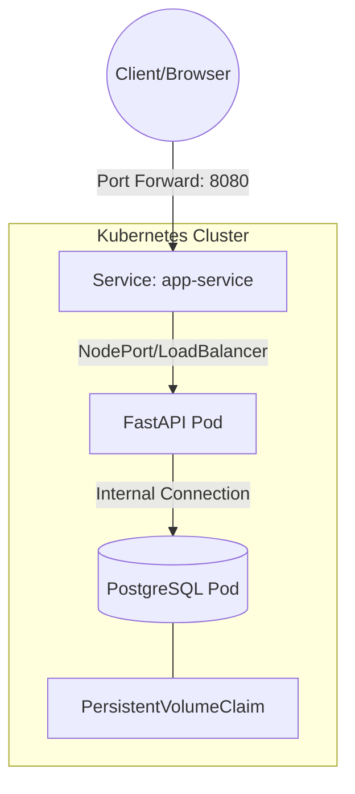

---

# infra_demo

<p align="left">


</p>

## 📌 Overview

This project is an infrastructure-focused demo application built to practice deploying a containerized web service using **Docker** and **Kubernetes (kind)**.

It serves as a practical exercise for a full-time infrastructure/Kubernetes-focused role. The core objective is mastering the transition from a local Docker environment to a functional Kubernetes cluster.

## 🏗 Architecture



## 📂 Project Structure

```text
.
├── app/                # FastAPI application source code
├── docker/
│   └── Dockerfile      # Optimized for production
├── k8s/                # Kubernetes manifests (YAML)
│   ├── deployment.yaml
│   ├── service.yaml
│   ├── configmap.yaml
│   └── pvc.yaml
├── docker-compose.yml  # Local development setup
└── .env.example        # Environment variable template

```

## 🛠 Tech Stack

| Category | Technology |
| --- | --- |
| **Backend** | FastAPI (Python 3.9+) |
| **Database** | PostgreSQL 15 |
| **Container** | Docker / Docker Compose |
| **Orchestration** | Kubernetes (kind) |

## 🚀 Getting Started

### 1. Local Development (Docker Compose)

Use Docker Compose to quickly spin up the app and database.

```bash
# Build and start
docker compose up --build

# Access
# App: http://localhost:8000
# DB Connectivity: http://localhost:8000/db

```

### 2. Kubernetes Deployment (kind)

Deploy the application to a local Kubernetes cluster.

```bash
# 1. Create a kind cluster
kind create cluster --name infra-cluster

# 2. Build the image
docker build -t infra-demo:0.1 -f docker/Dockerfile .

# 3. Load the image into the cluster
kind load docker-image infra-demo:0.1 --name infra-cluster

# 4. Apply all manifests
kubectl apply -f k8s/

# 5. Verify the deployment
kubectl get pods -n infra-demo
kubectl get svc -n infra-demo

# 6. Access the application
kubectl port-forward svc/app-service 8080:80 -n infra-demo

```

## 📡 Endpoints

| Endpoint | Method | Description |
| --- | --- | --- |
| `/` | `GET` | Welcome message |
| `/db` | `GET` | Health check for DB connection |
| `/healthz` | `GET` | K8s Liveness/Readiness probe |

## 🔍 Troubleshooting

* **ImagePullBackOff**: Ensure the image name in `deployment.yaml` matches the tag used in `docker build` and that you've run `kind load`.
* **DB Connection Refused**: Check if the `POSTGRES_HOST` in the ConfigMap matches the Service name of the PostgreSQL pod.

## 📈 Future Improvements

* [ ] Add **Ingress Controller** (Nginx)
* [ ] Implement **Resource Quotas** and Limits
* [ ] Integrate **Prometheus/Grafana** for monitoring
* [ ] Automate deployment with **GitHub Actions**

---

**Author:** [Ikayou](https://www.google.com/search?q=https://github.com/Ikayou)

---
